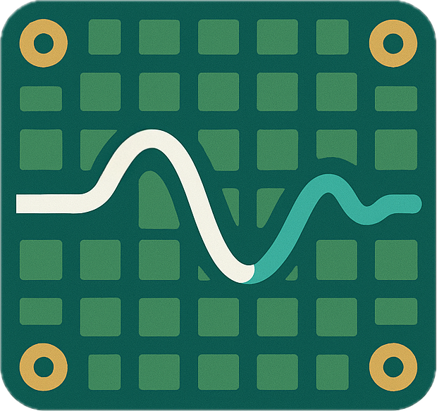

# LabOrchestra

> **Orchestrate your lab – without the tangle.**
> *A modular C# + Python framework for controlling and orchestrating multiple scientific instruments.*

*Disclaimer: LabOrchestra is currently under heavy development. We will be working on documentation soon. In case you want to start using it now, keep in mind that breaking code changes will happen.*

{width=200}

---

## Table of Contents

1. [Why LabOrchestra?](#why-laborchestra)
2. [Features](#features)
3. [Quick Start](#quick-start)
4. [Hello‑World Drivers](#hello-world-drivers)
   * [Python](#python-driver)
   * [C#](#c-driver)
5. [Architecture](#architecture)
6. [Roadmap](#roadmap)
7. [Contributing](#contributing)
8. [License](#license)

---

## Why LabOrchestra?

Scientific experiments often juggle dozens of devices, each with its own user interface, API and configuration quirks. And most of the time, you have to **choose whether** to use the supplied software for having a **live view** on the experiment **or** access the experiment from **Python scripts** while being blindfolded about what's going on. **LabOrchestra** gives you **a single orchestration layer** that provides a common user interface while simultaneously providing control to Python – one API to rule all devices:

* unite different devices in a command layer – like instruments in an orchestra
* a unified UI – accessible via the browser, optionally remotely and on the phone
* data acquistion management included – including all your metadata

## Features

| Category                 | Highlights                                                                                   |
| ------------------------ | -------------------------------------------------------------------------------------------- |
| **Cross‑language**       | .NET 8 host with \[pythonnet] bridge – write drivers in the language that suits your device. |
| **Declarative metadata** | `typing.Annotated` decorators (Py) & reflection attributes (C#) auto‑generate UI forms.      |
| **Event bus**            | Push‑based state updates; fall back to polling if the device can’t emit events.              |
| **Web dashboard**        | Blazor‑powered UI; dark‑mode ready; live plots via SignalR.                                  |
| **Modular core**         | Plug‑in discovery through NuGet/PyPI packages – zero‑config install.                         |
| **Record‑&‑Replay**      | Capture every command/state pair for audit or simulation.                                    |

---

## Roadmap

* **0.1** – Improve device management (dynamic addition/removal of devices) + device management UI
* **in parallel** - Write documentation for the framework
* **0.2** - Adaptable UI via drag & drop
* **future** - Create basic UI controls from within Python devices
* **fuuuture** - Add a marketplace for sharing device drivers

---

## Quick Start

### Prerequisites

* Windows, Linux or macOS
* [**.NET 9.0 SDK**](https://dotnet.microsoft.com/en-us/) or newer.
* [**Python ≥ 3.13**](https://www.python.org/downloads/)
* [**NodeJS**](https://nodejs.org/en)
* [**pnpm**](https://pnpm.io/installation)

### Install & Run

```bash
# 1 · Clone the repository
$ git clone https://github.com/stephtr/LabOrchestra.git
$ cd LabOrchestra

# 2 · Install the client packages
$ pnpm install

# 3 · Bootstrap Python side
$ cd server
$ python -m venv .venv && source .venv/bin/activate
$ pip install -r requirements.txt  # installs required python 

# 4 · Launch the server
$ dotnet run
```

Browse to `https://localhost:5095`, ignore the certificate warning and interact with the dashboard.

---

## Hello‑World Drivers

### Python driver <a name="python-driver"></a>

```python
# drivers/blinky.py
from typing import Annotated
from laborch.sdk import parameter, event

class Blinky:
    """A virtual LED that can blink."""

    @parameter("Blink period", unit="ms", min=10, max=1000)
    def __init__(self, period: Annotated[int, "ms"] = 500):
        self.period = period
        self.state = {"on": False}

    def start(self):
        self._timer = event.every(self.period, self._toggle)

    def _toggle(self):
        self.state["on"] = not self.state["on"]
        event.push(self.state)  # ships to C# host
```

### C# driver <a name="c-driver"></a>

```csharp
// Drivers/BlinkyCs.cs
using LabOrchestra.SDK;

public class BlinkyCs
{
    [Parameter("Blink period", Unit="ms", Min = 10, Max = 1000)]
    public BlinkyCs(int period = 500)
    {
        _period = period;
    }

    public void Start(IEventBus bus)
        => _timer = bus.Every(TimeSpan.FromMilliseconds(_period), () =>
        {
            _state.On = !_state.On;
            bus.Push(_state);
        });

    private readonly int _period;
    private readonly LedState _state = new();
    private IDisposable? _timer;
    private record LedState(bool On = false);
}
```

Drivers are picked up automatically when the assembly / module is on the search path.

---

## Architecture

```
┌────────────┐   SignalR     ┌──────────────┐
│  Web UI    │◀────────────▶│   Host API   │
└────────────┘              └────┬─────────┘
                                 │Interop (C# ↔ Python)
            Device Events        │
┌────────────┐  JSON RPC  ┌──────▼──────┐
│  Python    │◀──────────▶│  C# Core   │
│  Drivers   │            │  Engine    │
└────────────┘            └────┬───────┘
                               │Sub‑process / Serial / TCP
                     ┌─────────▼─────────┐
                     │ Physical Devices  │
                     └────────────────────┘
```

---

## Contributing

We are open for external contributions! Since things are currently under heavy development, please get in touch with us, optimally before working on a new feature.

1. Fork & clone the repo.
2. Submit a PR.

### Code of Conduct

We follow the [Contributor Covenant](https://contributor-covenant.org/version/2/1). Be excellent to each other.

---

## License

For licensing, get in touch with us. A release under a dual-license will follow soon. Use for non-commercial research will be always free!

© 2025 LabOrchestra Developers.
